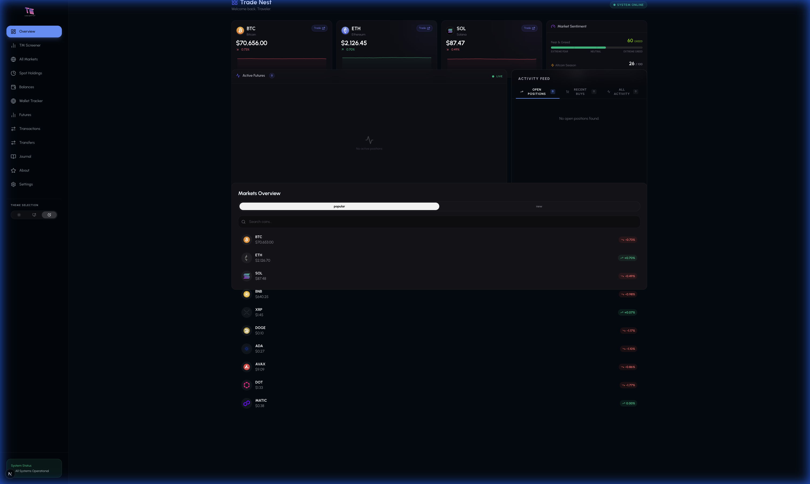
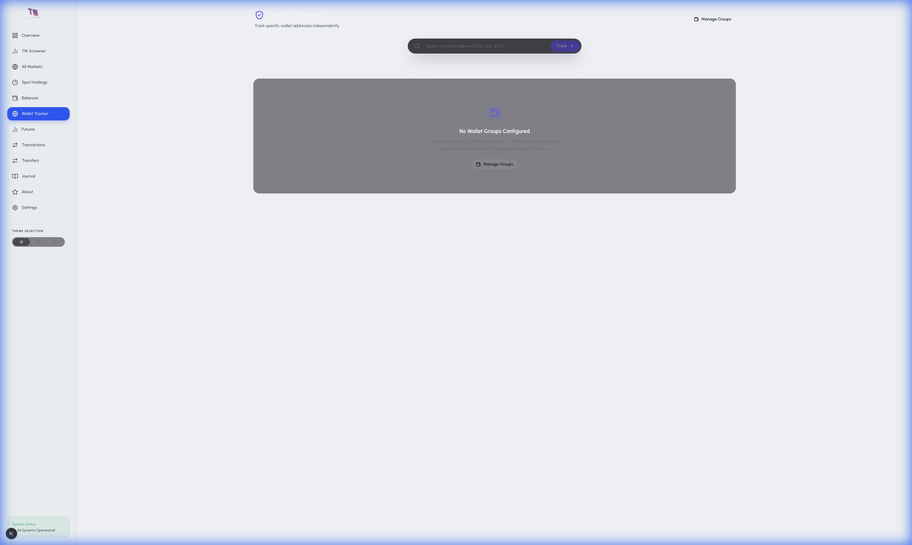

# Trade Marathon® — Advanced Crypto Portfolio Tracker

[](https://nextjs.org/)
[](https://tailwindcss.com/)
[](https://www.framer.com/motion/)

A state-of-the-art, pro-trader dashboard designed for ultimate portfolio transparency and market edge. Featuring an advanced glassmorphic UI kit, it combines aggressive real-time data fetching with a premium aesthetic.



## ✨ Core Pillars

### 🎨 Premium Aesthetic (UI Kit)
Experience a premium, "dark-mode-first" interface built for high-performance trading:
- **NeoCard**: Glassmorphic containers with dynamic animated "border beams" and responsive glow effects.
- **GlassPanel**: Sophisticated backdrop blur with subtle noise texture for depth.
- **AnimatedValue**: Smooth, physics-based count-up/down tickers for real-time price updates.
- **PulseIndicator**: Live "active" status markers for real-time data streams.

### 🔍 Standalone Zerion Integration
Track any wallet address with full transparency, independent of global settings:
- **Multi-Chain Support**: Aggregated view across EVM, Solana, Bitcoin, and more.
- **DeFi & NFT Discovery**: Automatically identifies complex DeFi positions and NFT collections.
- **Independent Fetching**: Manage ad-hoc wallets and groups locally without cluttering primary settings.



### 📊 Professional Analytics
- **Futures P&L Mastery**: Lifetime drawdown, win rate, and profit factor analytics.
- **Real-Time Market Heat**: Integrated Sentiment Widget (Fear & Greed) and Altcoin Season Index.
- **High-Frequency Polling**: Positions and balances refresh every 2-3 seconds for maximum accuracy.

## 🛠 Tech Stack

- **Core**: Next.js 16 (App Router), TypeScript.
- **UI/UX**: Tailwind CSS 4, Framer Motion, Radix UI (Shadcn), Lucide Icons.
- **Data Engine**: CCXT (Binance, Bybit), Hyperliquid SDK, Zerion API.
- **State & Fetching**: TanStack Query (React Query), Custom React Hooks.
- **Charts**: Recharts (with custom gradient masks).

## 🚀 Getting Started

### 1. Prerequisites
- Node.js 18+
- npm / pnpm / yarn

### 2. Installation
```bash
git clone https://github.com/Trademarathon/portfolio-tracker.git
cd portfolio-tracker
npm install
```

### 3. Setup Environment
Create a `.env` file in the root (copy from `.env.example`):
```env
NEXT_PUBLIC_HYPERLIQUID_API_URL=https://api.hyperliquid.xyz
# Add CEX/Wallet API keys as needed
```

### 4. Launch
```bash
npm run dev
```

### 5. Running with the API server (browser / CEX / Journal)
The app uses a static export. For CEX connections, journal sync, wallet API, and other server-side features you need the standalone API server:

1. In one terminal: `npm run api-server` (listens on `http://127.0.0.1:35821` by default).
2. In `.env`, set: `NEXT_PUBLIC_API_URL=http://127.0.0.1:35821`
3. For journal (Prisma): set `DATABASE_URL="file:./dev.db"` (or your SQLite path) and run `npx prisma generate` (and migrations if needed).

Then run `npm run dev` and open the app in the browser.

---

Built for traders who demand excellence. 🚀
