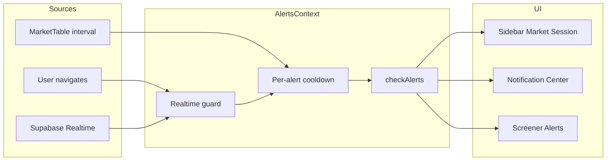

# Alerts and Notifications – How It Works

This doc describes how alerts, signals, notification settings, and cloud sync behave after the "alerts and notifications stable across navigation" implementation.

---

## Overview

| Concept | Where it lives | Storage key(s) |
|--------|----------------|----------------|
| **Alerts** (portfolio/screener) | [AlertsContext](portfolio-tracker/src/contexts/AlertsContext.tsx) | `portfolio_alerts` (or legacy), `portfolio_signals` |
| **Notification settings** | Read in AlertsContext / useAlerts; written only on user action | `screener_alert_settings` (browser notifications for screener), `portfolio_alert_settings` (advanced alerts) |
| **Alert history** | Used by Sidebar Market Session badge and Notification Center | `portfolio_alert_history` (e.g. last 200 entries) |

Notification settings are read from localStorage (or sync when on) and are **never** reset on route change; they are only written when the user explicitly changes them (e.g. in Alerts Sidebar or Settings).

---

## Cloud-as-memory rule

- **Sync on** (Supabase Auth + "Sync to cloud" enabled): Supabase `user_data` is the source of truth for synced keys. The app must not overwrite local state with an empty or stale cloud payload.
- **Sync off**: localStorage (and in-memory refs where used) is the only source of truth.

---

## Realtime (Supabase)

- [SupabaseAuthContext](portfolio-tracker/src/contexts/SupabaseAuthContext.tsx) subscribes to `user_data` Realtime.
- [AlertsContext](portfolio-tracker/src/contexts/AlertsContext.tsx) handles updates in `handleRealtimeSyncUpdate`.

**Guard:** If the cloud payload is null, empty string, or parses to an empty array while the current local list (signals or alerts) has items, the context **does not** call `setSignals([])` / `setAlerts([])` — it treats the payload as stale. Cloud data is only applied when it is non-empty or clearly newer, so the list does not clear when switching pages or when another tab sends an empty sync.

---

## Per-alert cooldown

In `checkAlerts` (AlertsContext):

- A ref holds `lastTriggeredRef.current = Map<alertId, timestamp>`.
- Before adding a signal or sending a notification, the code checks: if `Date.now() - lastTriggered < ALERT_COOLDOWN_MS` (e.g. 3 minutes), the trigger is **skipped**.
- When an alert does trigger, it sets `lastTriggeredRef.current.set(alert.id, Date.now())`.

This prevents the same alert from re-firing when the user navigates between Overview, Screener, Spot, Balances, etc., where `checkAlerts` may run again.

---

## Where checkAlerts runs

- [MarketTable](portfolio-tracker/src/components/Screener/MarketTable.tsx) runs an interval (e.g. every 5s) that calls `checkAlerts(prices, metrics)` and `detectSignals`.
- **Guard:** For the first 2 seconds after mount, the interval does **not** call `checkAlerts` / `detectSignals`, so navigating to the Screener does not cause an immediate extra evaluation burst.

---

## AI and feed components

| Component | Behavior |
|-----------|----------|
| **useAIFeedAlerts** ([useAIFeedAlerts.ts](portfolio-tracker/src/hooks/useAIFeedAlerts.ts)) | "Already notified" is stored in a **module-level** ref (`processedSignalsRef`), so it survives navigation between Overview, Spot, Balances. The same AI feed signal does not re-notify after a route change. |
| **useScreenerAiInsightSymbols** ([useScreenerAiInsightSymbols.ts](portfolio-tracker/src/hooks/useScreenerAiInsightSymbols.ts)) | Symbol list is in state. When sync is on, initial load and updates use [getValueWithCloud](portfolio-tracker/src/lib/supabase/sync.ts) / [setValueWithCloud](portfolio-tracker/src/lib/supabase/sync.ts) for `screener_ai_insight_symbols`, so the list is stable across tabs and navigation. |
| **PlaybookDedicatedFeed** ([PlaybookDedicatedFeed.tsx](portfolio-tracker/src/components/Journal/PlaybookDedicatedFeed.tsx)) | Executed orders are persisted to localStorage. When sync is on, load/save also goes through the sync layer for `playbook_executed_orders`, so state is consistent across devices. |

---

## Sidebar Market Session card

- [Sidebar](portfolio-tracker/src/components/Layout/Sidebar.tsx) shows the current market session (e.g. LONDON), volume badge, and **alert count** (unacknowledged items from alert history).

**Stable across navigation:**

- `recentAlerts` state is **initialized** from `loadAlertHistory()` with the same filter (last 24h, unacknowledged first, top 5), so the badge does not flash 0 on mount.
- When sync is on, the refresh effect loads history via `getValueWithCloud(ALERT_HISTORY_KEY, ...)` so the count matches cloud and other tabs.

---

## Data flow (high level)

---

## Related code

| Area | Path |
|------|------|
| Alerts state and checkAlerts | `src/contexts/AlertsContext.tsx` |
| Sync layer (get/set with cloud) | `src/lib/supabase/sync.ts` |
| Auth and Realtime subscription | `src/contexts/SupabaseAuthContext.tsx` |
| Market Session card and alert count | `src/components/Layout/Sidebar.tsx` |
| Alert history load/save | `src/lib/api/alerts.ts` (e.g. `loadAlertHistory`, `ALERT_HISTORY_KEY`) |
